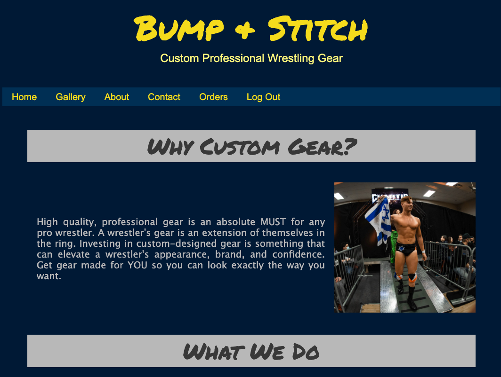
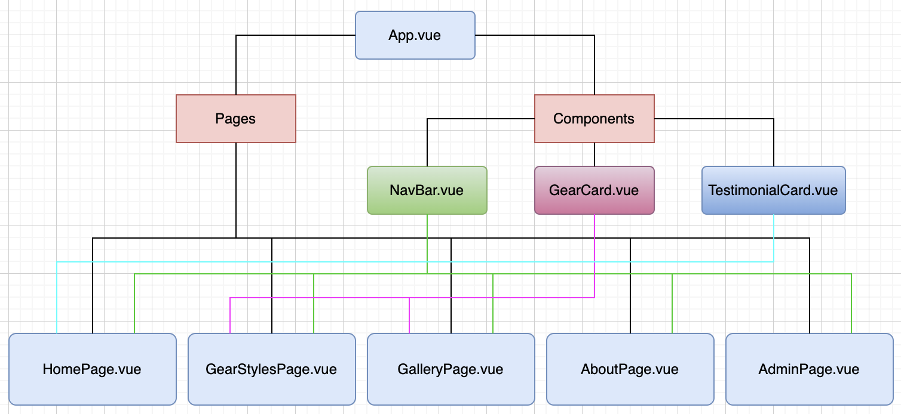
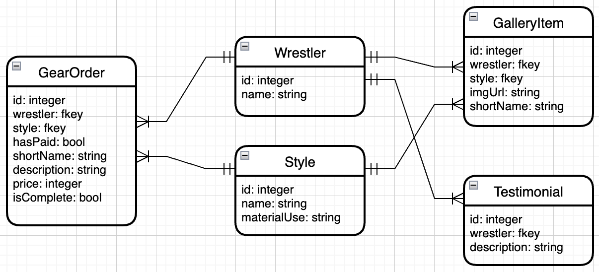

# Bump and Stitch

## Developed by Brad Lewis

---

## **_Concept_**

This is a site designed to showcase professional wrestling gear constructed by one of the top gear-makers in New England. For 3 years, Cashew has designed, fitted, and created gear for many wrestlers throughout the New England area, and has received stellar endorsements from his clients. Up to this point, the only way to contact Cashew to place an order was by word of mouth. This site creates an opportunity for Cashew to expand from casual recommendations for gear to a professional side hustle. The title "Gear by Cashew" was the original name of the business, but has since been updated to "Bump + Stitch".

---

## **_Site Layout_**

The site is built as a full stack app using the Vue.js framework and a Django backend. The site has two main objectives: (1) display information about the business, its services, and its prior work, and (2) serve as an organizational tool for the business owner.

Most users to the site only have access to the Home page, Gallery, About page, and Contact page. When an admin logs in on the admin page, they are navigated to the Orders page, which is hidden for non-admin users. The orders page is where an admin can manage orders that have been placed and update them as progress is made.

---

## **_Screenshots_**

**Home page** - notice the "Orders" and "Logout" on the nav bar. These only appear because the screenshot was taken during an admin login. Had the admin been logged out, they would be replaced with an "Admin" link instead.

**Orders page** - visible only to admin. This table shows all orders that have been placed. The admin has full CRUD over these items.

**New order** - this is the form that appears when the admin initiates a new order. The "Please complete all fields" banner changes to a button once the fields are completed.

**Update order** - clicking the update button in the leftmost table column also reveals the form, pre-populated with the existing data. Here the admin can either change the data or delete the order entirely.

## **_App Structure_**

**Component Hierarchy Diagram**

**Entity Relationship Diagram**

